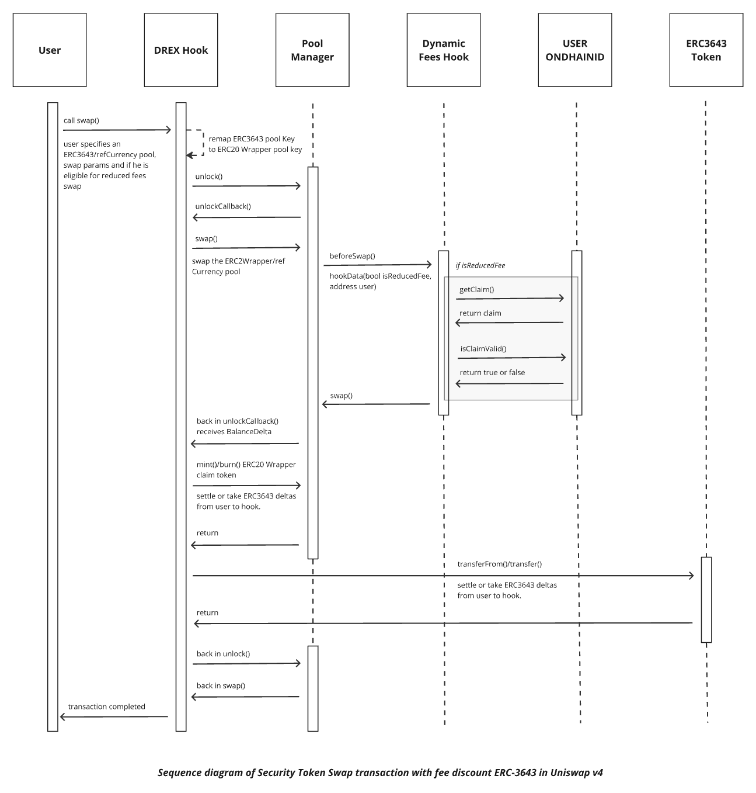

# RDEX Hook regulated markets for RWA price discovery.
Uniswap V4 hook implementation for decentralized ERC-3643 Tokens price discovery mechanisms.

## Contracts Overview
- `RDEXHook.sol`: Main contract that integrates with Uniswap V4 to manage liquidity and swaps for ERC-3643 compliant tokens.
- `RDEXDynamicFeeHook.sol`: Manages dynamic fee adjustments based on predefined rules to optimize transaction costs within the trading environment.
- `ERC20RDEXWrapper.sol`: Wraps ERC-3643 tokens into ERC-20 tokens to enable broader compatibility with Uniswap V4.

Each contract is designed to ensure compliance and efficiency in trading operations involving real-world assets.

## Deployments

Deploy: // TODO Delete
``` bash
source .env
forge script script/DeploySystem.s.sol --rpc-url <network name> --broadcast --private-key $OWNER_SK --tc DeploySystem
```
Print info to mine Hook addresses, we used [uni-v4-hook-address-miner](https://github.com/GianfrancoBazzani/uni-v4-hook-address-miner) to mine the addresses
```bash
forge script script/HookAddressMinerInfo.s.sol --tc HookAddressMinerInfo
```
**Owner address**: 0x1038d5A420AEa8aDc479D654D815f92ADC0106c0 

### Sepolia

**sepolia RDEXDynamicFeeHook**: 0xFD75d54faf4062D2B465964Aa55B8e0543C79080 [blockscout verified sources](https://eth-sepolia.blockscout.com/address/0xFD75d54faf4062D2B465964Aa55B8e0543C79080?tab=contract)
**sepolia RDEXHook**: 0x422096783ab2a81a230d3b9dcafd8c337b24a000 [blockscout verified sources](https://eth-sepolia.blockscout.com/address/0x422096783AB2a81a230D3b9DcaFd8c337b24a000?tab=contract)

 ### Unichain

#### Hooks
 - **unichain RDEXDynamicFeeHook**: 0x74e3a272ae44fdf370659f919d46ea30ebcc9080 [blockscout verified sources](https://unichain-sepolia.blockscout.com/address/0x74e3A272AE44fDF370659f919d46EA30EBcC9080?tab=contract)
 - **unichain RDEXHook**:  0x25a8680890d9a8e61f6b2ee68f845321c10b2000 [blockscout verified sources](https://unichain-sepolia.blockscout.com/address/0x25A8680890d9A8E61F6B2ee68f845321c10B2000?tab=contract)
- **hook Identity**: 0xBf59379c1df92A039B1291d2dC20C92359564Ab7

#### TREXSuite 
 - **ClaimTopicsRegistry Implemetation**: 0x76658f6106b15C6f21D64Db1FdDf836B5B3bc0BD
 - **TrustedIssuersRegistry Implemetation**: 0x3Cb16616D1865a37b3C5a364a1526Ae5317042f8
 - **IdentityRegistryStorage Implemetation**: 0xA15e7c44fcAEE2CFC5656bfea42dacA813314126
 - **IdentityRegistry Implemetation**: 0x28fd7c589AEe1e016F06eC590bb1a471cEf1d37a
 - **Token Implemetation**: 0xFb22eecA2e2B5263dDDC3de12612182E47728E35
 - **TREXImplementationAuthority**: 0xD1B274E8afCaB3faa664Ff81cA830521Fa1871bD
 - **IdentityRegistryStorage**: 0x0CC39Caa12A812A53A448028536B64ec0cD09D70
 - **IdentityImplemetation**: 0x277F40E7E89691504F8a1AAbd2c4E9Cb1a19EEd6
 - **IdentityIA**: 0xF1a818E4b40a47Bdf235Df1712c293Be309E98B9
 - **IdentityFactory**: 0x197b483c8e606C0B022de2E9cFcb7F7c2DFDEd65
 - **TREXFactory**: 0xE412eFF97d64Cec48E7792Cf29B56C190fF67aDA

 #### UHI Token
 - **UHI Token Identity**: 0x5E5064ec7cf549FDb242Cf3e1528047f3CaeB74a
 - **UHI Token ClaimTopicsRegistry**: 0x38AFaD0b7C80863FD436F20CDBB577E9692F37Da
 - **UHI Token TrustedIssuersRegistry**: 0x90df67D7E821B85f19fEA26894e55d388cdD295f
 - **UHI Token Compliance**: 0x1d79574C0Ae43F381470dA5EC91EE13b42ABff4D
 - **UHI Token IdentityRegistry**: 0xD8a33dDaE377450ea6657B2d6B973F288602D5eE
 - **UHI Token Token**: 0x98000e1F41C75ea1Ff688978ef79932a022d2cB4
 - **UHI Token AgentManager**: 0x059841FA575d8Cf37b5D658aCE4DebC1d4fa2BDB
-   **Claim Issuer Identity**: 0xC304B65C6f82a6C438f9B1B442d844b1058d0B07

#### Others
 -  **owner**: 0x1038d5A420AEa8aDc479D654D815f92ADC0106c0
 - **Alice Identity**: 0xD87326F5C4AA4dd9F0D39ef62904e74586764541
 - **USDC**: 0x31d0220469e10c4E71834a79b1f276d740d3768F


## Definitions

- **ERC3643**: ERC3643 is a token standard designed for regulated assets, providing features like identity verification and compliance checks. It ensures that tokens can only be transferred between verified addresses, making it suitable for real-world asset tokenization.

- **ONCHAINID**: ONCHAINID is a decentralized identity framework that provides a secure and verifiable way to manage identities on the blockchain. It is used to store and verify claims about entities, such as compliance status or identity verification, ensuring that only authorized parties can interact with regulated tokens like ERC-3643.

- **Reference Currency**: In the context of the RDEXHook, a reference currency is a stable currency used as pricing currency. The status of the reference currency should be given by a trusted entity through the emission of a specific claim that will be added to the currency's ONCHAINID contract.

- **ERC20RDEXWrapper**: This is a contract that wraps ERC-3643 tokens into ERC-20 tokens, allowing them to be used within the Uniswap V4 ecosystem. The wrapper ensures compatibility and facilitates trading by providing an ERC-20 interface for ERC-3643 tokens. Additionally, the wrapper tokens can only be held by the RDEXHook or the pool manager.

- **Wrapper Pool**: A wrapper pool is a liquidity pool that involves wrapped tokens,(ERC20RDEXWrapper), and a reference currency. It allows for trading and liquidity provision using the wrapped ERC-20 tokens, enabling a price discovery mechanism for ERC-3643 without breaking the built-in compliance of the token.

- **Claim**: A claim is a piece of data that asserts certain properties about a token or an entity, such as compliance with regulatory standards. In the RDEXHook, claims are used to verify the authenticity and compliance of reference currencies and are also used to prove the discount fee status by the users.

- **Claim Issuer**: A claim issuer is a trusted entity that provides claims, verifying certain attributes or compliance of tokens or entities.

- **Identity**: refers to an ONCHAINID contract that can hold verifiable claims on-chain. This ensures that only authorized and compliant entities can interact with the tokens, maintaining regulatory compliance and security.


## ERC20 Wrapping Mechanism (Wrapped pool initialization)

The `RDEXHook.sol` contract implements a mechanism to wrap ERC-3643 tokens into ERC-20 tokens, facilitating their use within the Uniswap V4 ecosystem. This is achieved through the following steps:

1. **ERC20RDEXWrapper Deployment**: The contract uses the `Clones` library to create a clone of the `ERC20RDEXWrapper` contract. This clone acts as the ERC-20 representation of the ERC-3643 token.

2. **Identity Verification**: Before wrapping, the contract verifies that the ERC-3643 token is compliant and that the contract itself is verified by the token's identity registry. This ensures that only authorized tokens are wrapped.

3. **Claim Validation**: The contract checks if the reference currency is a verified claim by the trusted issuer. This step is crucial for maintaining the integrity and trustworthiness of the wrapped tokens.

4. **Wrapper Initialization**: The newly created ERC-20 wrapper is initialized with a name and symbol derived from the original ERC-3643 token. It also sets a whitelist of addresses that are allowed to interact with the wrapper, including the pool manager.

5. **Pool Initialization**: The contract initializes a pool for the ERC-20 wrapper against a reference currency. This pool is where the actual trading and liquidity operations occur, using the wrapped tokens.

This wrapping mechanism allows ERC-3643 tokens, which are typically used for regulated assets, to be traded in a decentralized manner while maintaining compliance with regulatory standards.


## Liquidity Provision and Position Identification

In the `RDEXHook.sol` contract, liquidity provision is managed through a mechanism that allows users to add or remove liquidity from the wrapper pools. This process involves several key steps and utilizes a unique method for identifying user liquidity positions.

### Liquidity Provision Process

1. **Modify Liquidity Function**: Users can modify their liquidity in a pool by calling the `modifyLiquidity` function. This function takes parameters that specify the pool key of the ERC-3643 and the reference currency, liquidity amounts, and additional hook data.

2. **Callback Data Preparation**: The function prepares a `CallBackData` structure that includes details about the liquidity modification, such as the pool key, user address, and liquidity parameters.

3. **Wrapper Pool Interaction**: The actual liquidity modification occurs in the wrapper pool, which involves the wrapped ERC-20 tokens and the reference currency. The contract ensures that the liquidity is added or removed in compliance with the ERC-3643 token standards.

4. **Delta Settlement**: After modifying liquidity, the contract settles the balance delta, ensuring that the correct amounts are transferred between the user, the hook, and the pool. The ERC20Wrapper tokens owed by the hook to the pool manager represent the ERC3643 tokens owed by the user to the hook. The reference currency is directly settled between the user and the pool manager.

### Identifying Liquidity Positions

To uniquely identify and manage user liquidity positions, the contract uses a hashing mechanism:

- **Position Key Calculation**: The position of a user's liquidity is identified by calculating a unique position key. This key is derived by hashing the user's address along with a salt value. The salt is a random or user-defined value that helps distinguish between different positions held by the same user.

ERC-3643 liquidity position salt = user-defined-value
ERC-20 Wrapper pool liquidity position salt:  keccak256(msg.sender , user-defined-value)

This ensures that we can identify the owner of each liquidity position even if all positions of the wrapper pools are being controlled by the hook. By using a unique position key derived from the user's address and a salt value, the contract maintains a clear mapping of ownership.


## Dynamic Fee Hook and ONCHAINID Integration in RDEXDynamicFeeHook.sol

The `RDEXDynamicFeeHook.sol` contract is connected to the wrapper pools, leveraging the ONCHAINID system to allow certain users to demonstrate their eligibility for a liquidity provider (LP) fee discount.  Only users with valid claims can access reduced fees.


## Call diagram for swap




## Demo Tests

1. ERC-6909 PoC
   
```shell
$ forge test -vv —mt test_complianceCanBeBypassed
```

1. Hook Markets

```shell
$ forge test -vv —mt test_poolWithCompliantTokenAndVerifiedReferenceCurrencyCanBeInitialized
```

```shell
$ forge test -vv —mt test_tokenOwnersShouldBeAbleToModifyLiquidity
```

```shell
$ forge test -vv —mt test_tokenOwnersShouldBeAbleToSwap
```

3. Hook Fees
   
```shell
$ forge test -vv —mt test_discountTopicsGetApplied
```